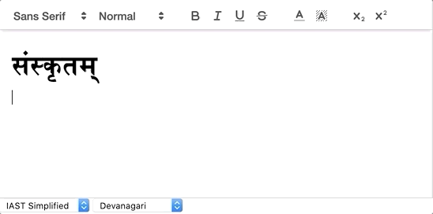

# Bhasha Quill
A QuillJs plugin to write in Sanskrit with support for IAST, Devanagari, and more.

## Demo


You can see a demo [here](https://trivedigaurav.com/exp/bhasha), or check out this [example](http://github.com/trivedigaurav/bhasha-quill-example/) repository.

## Getting Started

### Add npm dependency
```bash
npm install --save https://github.com/trivedigaurav/bhasha-quill
```
Or use your favorite package manager.

### Import Quill module
```javascript
import Bhasha from 'bhasha-quill';
Quill.register("modules/bhasha", Bhasha);

var quill = new Quill('#quill-container', {
    modules: {
        bhasha: {
            fromDropdown: '#bhasha-from',
            toDropdown: '#bhasha-to'
        }
    },
    theme: 'snow',
});
```

Pass the names of the from and to dropdowns to update the transliteration scheme as shown above.

### Transliteration Schemes
This plugin supports Devanagari, IAST, ITRANS, and other schemes by [Sanscript.js](https://github.com/sanskrit/sanscript.js/). 

#### IAST Simplified
I have also included a simplified IAST scheme that can be used to edit Sanskrit documents using ASCII characters available on a standard keyboard. This fork of Sanscript.js is available from http://github.com/trivedigaurav/sanscript.js/.

<table>
  <tr>
   <td>Vowels
   </td>
   <td>

<table>
  <tr>
   <td rowspan="2" >अ
<p>
<strong>a</strong>
   </td>
   <td rowspan="2" >आ
<p>
<strong>-a</strong>
   </td>
   <td rowspan="2" >इ
<p>
<strong>i</strong>
   </td>
   <td rowspan="2" >ई 
<p>
<strong>-i</strong>
   </td>
   <td rowspan="2" >उ
<p>
<strong>u</strong>
   </td>
   <td rowspan="2" >ऊ 
<p>
<strong>-u</strong>
   </td>
   <td rowspan="2" >ऋ
<p>
<strong>r.</strong>
   </td>
   <td rowspan="2" >ॠ
<p>
<strong>-r.</strong>
   </td>
   <td rowspan="2" >ऌ
<p>
<strong>l.</strong>
   </td>
   <td rowspan="2" >ॡ
<p>
<strong>-l.</strong>
   </td>
   <td rowspan="2" >ए
<p>
<strong>e</strong>
   </td>
   <td rowspan="2" >ऐ
<p>
<strong>ai</strong>
   </td>
   <td rowspan="2" >ओ
<p>
<strong>o</strong>
   </td>
   <td rowspan="2" >औ
<p>
<strong>au</strong>
   </td>
   <td rowspan="2" >ं
<p>
<strong>m.</strong>
   </td>
   <td rowspan="2" >ः
<p>
<strong>h.</strong>
   </td>
  </tr>
  <tr>
  </tr>
</table>


   </td>
  </tr>
  <tr>
   <td>Consonants

   </td>
   <td>

<table>
  <tr>
   <td rowspan="2" >क
<p>
<strong>ka</strong>
   </td>
   <td rowspan="2" >ख
<p>
<strong>kha</strong>
   </td>
   <td rowspan="2" >ग
<p>
<strong>ga</strong>
   </td>
   <td rowspan="2" >घ
<p>
<strong>gha</strong>
   </td>
   <td rowspan="2" >ङ
<p>
<strong>.na</strong>
   </td>
  </tr>
  <tr>
  </tr>
  <tr>
   <td rowspan="2" >च
<p>
<strong>ca</strong>
   </td>
   <td rowspan="2" >छ
<p>
<strong>cha</strong>
   </td>
   <td rowspan="2" >ज
<p>
<strong>ja</strong>
   </td>
   <td rowspan="2" >झ
<p>
<strong>jha</strong>
   </td>
   <td rowspan="2" >ञ
<p>
<strong>~na</strong>
   </td>
  </tr>
  <tr>
  </tr>
  <tr>
   <td rowspan="2" >ट
<p>
<strong>t.a</strong>
   </td>
   <td rowspan="2" >ठ
<p>
<strong>t.ha</strong>
   </td>
   <td rowspan="2" >ड
<p>
<strong>d.a</strong>
   </td>
   <td rowspan="2" >ढ
<p>
<strong>d.ha </strong>
   </td>
   <td rowspan="2" >ण
<p>
<strong>n.a</strong>
   </td>
  </tr>
  <tr>
  </tr>
  <tr>
   <td rowspan="2" >त
<p>
<strong>ta </strong>
   </td>
   <td rowspan="2" >थ
<p>
<strong>tha</strong>
   </td>
   <td rowspan="2" >द
<p>
<strong>da</strong>
   </td>
   <td rowspan="2" >ध
<p>
<strong>dha</strong>
   </td>
   <td rowspan="2" >न
<p>
<strong>na</strong>
   </td>
  </tr>
  <tr>
  </tr>
  <tr>
   <td rowspan="2" >प
<p>
<strong>pa</strong>
   </td>
   <td rowspan="2" >फ
<p>
<strong>pha</strong>
   </td>
   <td rowspan="2" >ब
<p>
<strong>ba</strong>
   </td>
   <td rowspan="2" >भ
<p>
<strong>bha</strong>
   </td>
   <td rowspan="2" >म
<p>
<strong>ma</strong>
   </td>
  </tr>
  <tr>
  </tr>
  <tr>
   <td rowspan="2" >श
<p>
<strong>‘sa</strong>
   </td>
   <td rowspan="2" >ष
<p>
<strong>s.a</strong>
   </td>
   <td rowspan="2" >स
<p>
<strong>sa</strong>
   </td>
   <td rowspan="2" >ह
<p>
<strong>ha</strong>
   </td>
   <td rowspan="2" > ळ
<p>
<strong>_la</strong>
   </td>
  </tr>
  <tr>
  </tr>
  <tr>
   <td rowspan="2" >य
<p>
<strong>ya</strong>
   </td>
   <td rowspan="2" >र
<p>
<strong>ra</strong>
   </td>
   <td rowspan="2" >ल
<p>
<strong>la</strong>
   </td>
   <td rowspan="2" >व
<p>
<strong>va</strong>
   </td>
   <td>
   </td>
  </tr>
  <tr>
   <td>
   </td>
  </tr>
</table>


   </td>
  </tr>
  <tr>
   <td>Vowel Marks (examples)

   </td>
   <td>

<table>
  <tr>
   <td rowspan="2" >क्
<p>
<strong>k</strong>
   </td>
   <td rowspan="2" >खा
<p>
<strong>kh-a</strong>
   </td>
   <td rowspan="2" >गि
<p>
<strong>gi</strong>
   </td>
   <td rowspan="2" >घी
<p>
<strong>dh-i</strong>
   </td>
   <td rowspan="2" >ङु
<p>
<strong>.nu</strong>
   </td>
  </tr>
  <tr>
  </tr>
  <tr>
   <td rowspan="2" >चू
<p>
<strong>c-u</strong>
   </td>
   <td rowspan="2" >छृ
<p>
<strong>chr.</strong>
   </td>
   <td rowspan="2" >जॄ
<p>
<strong>j-r.</strong>
   </td>
   <td rowspan="2" >झॢ
<p>
<strong>jhl.</strong>
   </td>
   <td rowspan="2" >ञॣ
<p>
<strong>~n-l.</strong>
   </td>
  </tr>
  <tr>
  </tr>
  <tr>
   <td rowspan="2" >टे
<p>
<strong>t.e</strong>
   </td>
   <td rowspan="2" >ठै
<p>
<strong>t.hai</strong>
   </td>
   <td rowspan="2" >डो
<p>
<strong>d.o</strong>
   </td>
   <td rowspan="2" >डौ
<p>
<strong>d.au</strong>
   </td>
   <td rowspan="2" >थ्
<p>
<strong>tha</strong>
   </td>
  </tr>
  <tr>
  </tr>
  <tr>
   <td rowspan="2" >णं
<p>
<strong>n.am</strong>
   </td>
   <td rowspan="2" >तः
<p>
<strong>tah.</strong>
   </td>
   <td rowspan="2" >क्ष
<p>
<strong>ks.a</strong>
   </td>
   <td rowspan="2" >त्र
<p>
<strong>tra</strong>
   </td>
   <td rowspan="2" >ज्ञ
<p>
<strong>j~na</strong>
   </td>
  </tr>
  <tr>
  </tr>
</table>


   </td>
  </tr>
  <tr>
   <td>Symbols

   </td>
   <td>

<table>
  <tr>
   <td rowspan="2" >ऽ
<p>
<strong>'</strong>
   </td>
   <td rowspan="2" >।
<p>
<strong>|</strong>
   </td>
   <td rowspan="2" >।।
<p>
<strong>||</strong>
   </td>
   <td rowspan="2" >०
<p>
<strong>0</strong>
   </td>
   <td rowspan="2" >१
<p>
<strong>1</strong>
   </td>
   <td rowspan="2" >२
<p>
<strong>2</strong>
   </td>
   <td rowspan="2" >३
<p>
<strong>3</strong>
   </td>
   <td rowspan="2" >४
<p>
<strong>4</strong>
   </td>
   <td rowspan="2" >५
<p>
<strong>5</strong>
   </td>
   <td rowspan="2" >६
<p>
<strong>6</strong>
   </td>
   <td rowspan="2" >७
<p>
<strong>7</strong>
   </td>
   <td rowspan="2" >८
<p>
<strong>8</strong>
   </td>
   <td rowspan="2" >९
<p>
<strong>9</strong>
   </td>
  </tr>
  <tr>
  </tr>
</table>


   </td>
  </tr>
</table>

#### Example Phrases

*IAST Simplified:*    nar-ah. gacchanti |

*IAST:*               narāḥ gacchanti.

*ITRANS:*             narAH gachChanti.

*Devanagari:*         नराः गच्छन्ति ।


